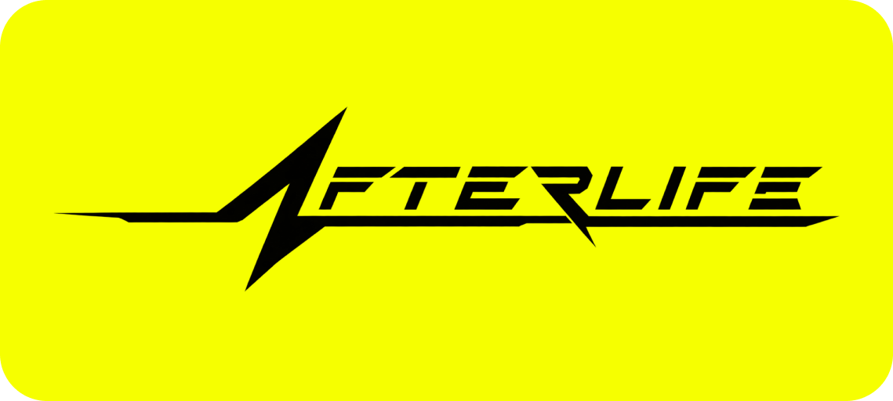
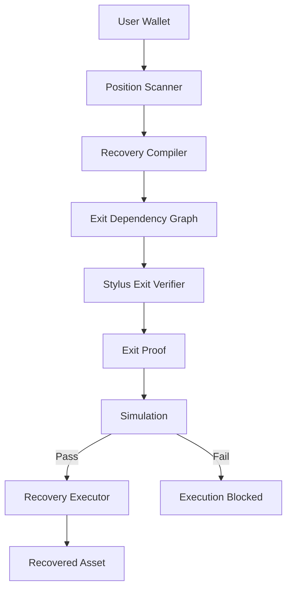
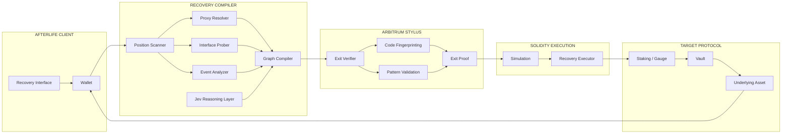
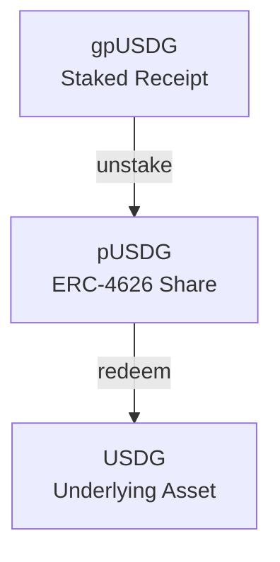
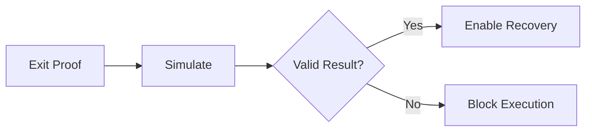
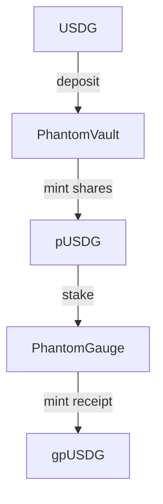
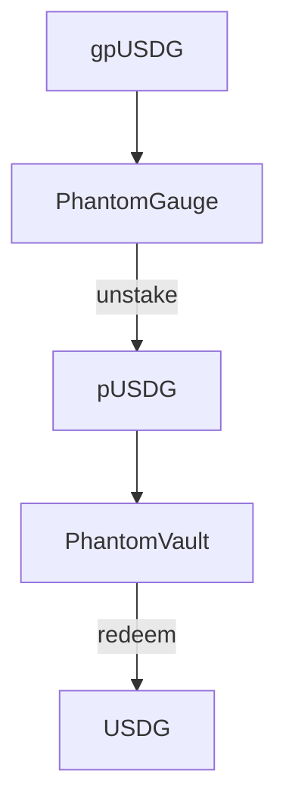
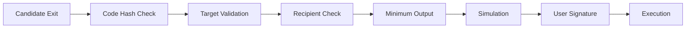
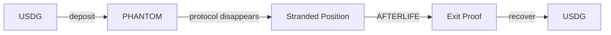
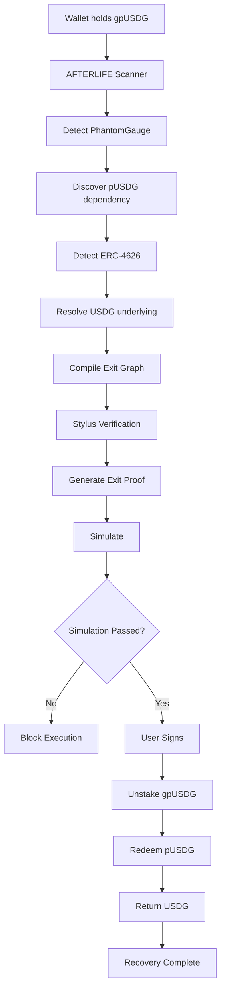

<div align="center">

<picture>
  <source media="(prefers-color-scheme: dark)" srcset="./AFTERLIFE.svg">
  <source media="(prefers-color-scheme: light)" srcset="./AFTERLIFE.svg">
  
</picture>

<br />
<br />

### Permissionless DeFi Exit Compiler for Arbitrum

**The frontend is dead. Your capital isn't.**

<br />

[](https://arbitrum.io/)
[](https://arbitrum.io/stylus)
[](https://soliditylang.org/)
[](https://www.paxos.com/usdg)

<br />

[](./LICENSE)
[](https://arbitrum.io/)

<br />

**AFTERLIFE reconstructs, verifies, and executes exit paths for stranded DeFi positions when the original application is gone.**

<br />

[The Problem](#the-problem) · [How It Works](#how-it-works) · [Architecture](#architecture) · [Exit Proof](#exit-proof) · [Live Demo](#live-demo) · [Security](#security-model) · [Contracts](#contracts)

</div>

---

## The Problem

DeFi contracts can survive longer than the companies that built them.

The frontend disappears.

The API stops responding.

The indexer dies.

The Discord closes.

The smart contracts are still there.

So are the user's assets.

The problem is that the **map back to those assets is gone**.

```text
User Deposit
     │
     ▼
┌─────────────┐
│    Vault    │
└──────┬──────┘
       │ receipt token
       ▼
┌─────────────┐
│   Staking   │
│    Gauge    │
└──────┬──────┘
       │ staked receipt
       ▼
┌─────────────┐
│ User Wallet │
└─────────────┘
```

Without the original interface, a user may need to determine:

```text
Which contract owns my position?

What does this token represent?

Is the contract a proxy?

Which implementation is live?

Do I have to unstake first?

What function returns the vault share?

What asset sits underneath it?

Has the contract changed?

Will the complete exit still succeed?
```

AFTERLIFE turns that manual contract archaeology into an automated recovery process.

---

# The Core Idea

<div align="center">

## DeFi positions should be self-exitable

</div>

AFTERLIFE treats every position as a dependency graph.

A wallet might appear to hold one token:

```text
gpUSDG
```

But economically the position may actually be:

```text
gpUSDG
   │
   │ unstake
   ▼
 pUSDG
   │
   │ redeem
   ▼
 USDG
```

AFTERLIFE reconstructs that graph directly from permissionless blockchain data.

It then compiles the graph into a machine-checkable:

# EXIT PROOF

---

## Exit Proof

An Exit Proof describes exactly how a position can currently be recovered.

```text
┌──────────────────────────────────────────────────┐
│                  EXIT PROOF                      │
├──────────────────────────────────────────────────┤
│ Owner            0x71A...                        │
│ Chain            Arbitrum Sepolia                │
│ Position         1,024.84 gpUSDG                 │
│ Final Asset      USDG                            │
│ Recipient        0x71A...                        │
│ Minimum Output   1,018.00 USDG                   │
│                                                  │
│ Contract fingerprints                    MATCH   │
│ Proxy implementations                   RESOLVED │
│ Exit graph                               VERIFIED │
│ Simulation                               SUCCESS │
│                                                  │
│ Status                              RECOVERABLE   │
└──────────────────────────────────────────────────┘
```

The Exit Proof binds the recovery plan to:

| Constraint | Purpose |
| --- | --- |
| Owner | Defines whose position is being recovered |
| Chain ID | Prevents cross-chain replay |
| Contract targets | Restricts execution scope |
| Code hashes | Locks recovery to analyzed implementations |
| Exit graph | Commits to the recovery sequence |
| Recipient | Prevents redirected funds |
| Minimum output | Protects the user from bad execution |
| Deadline | Prevents stale recovery plans |

If a relevant contract changes after analysis, the Exit Proof becomes invalid.

---

# How It Works



---

# Architecture



---

# 1. Position Scanner

AFTERLIFE begins with the wallet.

Not with the protocol.

The scanner looks for assets that may represent deeper positions.

### Data sources

```text
ERC-20 balances

wallet transaction history

Transfer events

staking receipts

vault shares

known position contracts

proxy relationships
```

### RPC primitives

```text
eth_getCode

eth_getStorageAt

eth_call

eth_getLogs
```

The original application's backend is not required.

---

# 2. Recovery Compiler

The Recovery Compiler is the core of AFTERLIFE.

Its job is to answer:

```text
What is this token?

        │
        ▼

What contract issued it?

        │
        ▼

What asset backs it?

        │
        ▼

Is it currently staked?

        │
        ▼

What operation releases it?

        │
        ▼

Is there another position underneath it?
```

The compiler combines several forms of evidence.

---

## Interface Probing

Examples:

```text
asset()

totalAssets()

convertToAssets()

previewRedeem()

balanceOf()

allowance()

stakingToken()

earned()
```

---

## Standards

The MVP focuses on structures that can be verified strongly:

```text
ERC-20

ERC-4626

ERC-1967 proxies

common staking wrappers
```

---

## Bytecode Analysis

Runtime bytecode can reveal:

```text
known selectors

code fingerprints

proxy structure

supported operation patterns
```

A selector alone is never considered proof of safe behavior.

---

## Event Analysis

Historical events help reconstruct contract relationships.

```text
Deposit

Withdraw

Transfer

Stake

Unstake

Redeem
```

---

# 3. Exit Dependency Graph

The compiler converts its findings into an explicit graph.



Each node represents:

```text
asset

contract

balance

ownership state
```

Each edge represents:

```text
target

function

arguments

input asset

output asset

expected state transition
```

AFTERLIFE is therefore not merely searching for:

```text
withdraw()
```

It is reconstructing:

```text
Position A
      │
      │ operation 1
      ▼
Position B
      │
      │ operation 2
      ▼
Underlying Asset
```

---

# 4. Stylus Exit Verifier

The deterministic verification layer runs using **Arbitrum Stylus**.

Written in Rust.

Its responsibilities include:

```text
external bytecode inspection

code fingerprinting

selector scanning

known-pattern matching

target validation

recovery-plan validation

Exit Proof hashing
```

Conceptually:

```rust
pub struct ContractFingerprint {
    pub target: Address,
    pub code_hash: B256,
    pub code_size: u64,
}

pub struct VerifiedStep {
    pub target: Address,
    pub selector: [u8; 4],
    pub code_hash: B256,
}
```

Stylus is used where AFTERLIFE actually benefits from it:

```text
bytecode processing

larger in-memory analysis

deterministic pattern verification

contract fingerprinting
```

It is not added merely as a hackathon checkbox.

---

# 5. Exit Proof Generation

Once the graph passes verification, AFTERLIFE produces an Exit Proof.

Conceptually:

```solidity
struct ExitProof {
    address owner;
    uint256 chainId;

    bytes32 graphHash;

    bytes32[] targetCodeHashes;

    address finalAsset;
    address recipient;

    uint256 minimumAmountOut;
    uint256 deadline;
}
```

The proof answers:

```text
WHO owns the position?

WHERE is the recovery happening?

WHAT contracts are allowed?

WHICH versions were analyzed?

HOW is the position unwound?

WHERE do recovered funds go?

HOW MUCH must be returned?
```

---

# 6. Simulation

No verified plan is immediately executed.

It must first survive simulation against current state.



AFTERLIFE verifies:

```text
all calls succeed

expected assets leave the position

expected underlying assets arrive

recipient matches

minimum output is satisfied

position balance decreases

unexpected assets are not transferred
```

Example:

```text
┌─────────────────────────────────────────────┐
│            RECOVERY SIMULATION              │
├─────────────────────────────────────────────┤
│                                             │
│ BEFORE                                      │
│                                             │
│ gpUSDG                         1,024.84      │
│ pUSDG                              0.00      │
│ USDG                               7.42      │
│                                             │
│ AFTER                                       │
│                                             │
│ gpUSDG                             0.00      │
│ pUSDG                              0.00      │
│ USDG                           1,032.26      │
│                                             │
│ Recovery                     1,024.84 USDG  │
│                                             │
│ Result                             PASS      │
└─────────────────────────────────────────────┘
```

---

# 7. Recovery Executor

Only verified recovery plans can reach the execution layer.

Depending on the target contracts, AFTERLIFE can perform:

```text
direct user calls

sequential recovery

compatible batched calls

router-based execution
```

### Important

AFTERLIFE does not claim every DeFi position can be atomically unwound.

Some protocols rely directly on:

```solidity
msg.sender
```

or require separate user-originated operations.

In those cases AFTERLIFE gives the user a controlled sequence.

```text
┌────────────────────────────────────────┐
│ STEP 1                                 │
│                                        │
│ Unstake gpUSDG                         │
│                                        │
│ Status                         COMPLETE│
├────────────────────────────────────────┤
│ STEP 2                                 │
│                                        │
│ Redeem pUSDG                           │
│                                        │
│ Status                    READY TO SIGN│
├────────────────────────────────────────┤
│ STEP 3                                 │
│                                        │
│ Receive USDG                           │
│                                        │
│ Status                          PENDING│
└────────────────────────────────────────┘
```

Atomic where possible.

Sequential where required.

---

# Jev

Jev helps AFTERLIFE reason about unfamiliar contracts.

Its job is discovery.

Not authority.

### Inputs

```text
runtime bytecode

known selectors

available ABI data

event history

historical calls

proxy implementation

view-call results

revert traces
```

### Outputs

```text
candidate contract classification

possible function semantics

candidate asset relationships

candidate exit graph

failure explanations
```

Example:

```text
Observed

Wallet owns:
1,024.84 gpUSDG

gpUSDG contract:
withdraw(uint256)

withdraw simulation:
returns pUSDG

pUSDG:
implements ERC-4626

pUSDG.asset():
returns USDG
```

Jev may propose:

```text
gpUSDG
  ↓ withdraw
pUSDG
  ↓ redeem
USDG
```

But Jev cannot authorize that path.

```text
Jev proposes.

Verifier validates.

Simulation tests.

User signs.
```

---

# Recovery Confidence

AFTERLIFE makes uncertainty visible.

## VERIFIED

```text
Structure              VERIFIED

Contracts              FINGERPRINTED

Exit calls             VERIFIED

Simulation             PASSED

Execution              ENABLED
```

---

## PARTIAL

```text
Structure              PARTIAL

Exit route             FOUND

Simulation             PASSED

Unknown element        PRESENT

Execution              RESTRICTED
```

---

## UNKNOWN

```text
Possible recovery path detected.

AFTERLIFE cannot establish enough
confidence for automatic execution.

Execution disabled.
```

A refusal is a valid output.

---

# The Kill Test

The hackathon demo revolves around one experiment.

<div align="center">

## Kill the application

## Keep the contracts alive

## Recover the money anyway

</div>

---

# PHANTOM

PHANTOM is a small DeFi protocol built specifically for the demonstration.



The user deposits:

```text
1,000 USDG
```

The final wallet position becomes:

```text
gpUSDG
```

Then PHANTOM disappears.

---

# Live Demo

## 00:00 — Deposit

```text
┌──────────────────────────────────────┐
│ PHANTOM                              │
│                                      │
│ Deposit                              │
│                                      │
│ 1,000 USDG                           │
│                                      │
│              DEPOSIT                 │
└──────────────────────────────────────┘
```

USDG enters the vault.

Shares are staked.

---

## 00:30 — Kill PHANTOM

The application is shut down.

```text
┌──────────────────────────────────────┐
│                                      │
│             PHANTOM                  │
│                                      │
│                 404                  │
│                                      │
│         SERVICE UNAVAILABLE          │
│                                      │
└──────────────────────────────────────┘
```

Stopped:

```text
frontend

application API

indexer
```

Still running:

```text
smart contracts
```

---

## 00:45 — Open AFTERLIFE

```text
┌──────────────────────────────────────┐
│ AFTERLIFE                            │
│                                      │
│ Scanning wallet...                   │
│                                      │
│ Contracts inspected              12  │
│ Candidate positions              03  │
│ Recoverable positions            01  │
└──────────────────────────────────────┘
```

Position found:

```text
1,0XX gpUSDG
```

---

## 01:10 — Reconstruction

AFTERLIFE discovers:



No PHANTOM frontend is queried.

No PHANTOM API is queried.

No PHANTOM indexer is queried.

---

## 01:40 — Exit Proof

```text
┌────────────────────────────────────────────┐
│ EXIT PROOF                                 │
├────────────────────────────────────────────┤
│                                            │
│ Vault structure                 VERIFIED   │
│ Gauge relationship              VERIFIED   │
│ Underlying asset                    USDG   │
│                                            │
│ Contract fingerprints             MATCH   │
│ Proxy implementations          RESOLVED   │
│ Simulation                       PASSED   │
│                                            │
│ Expected recovery          1,0XX.XX USDG  │
│ Recipient                       0xUSER...  │
│                                            │
│              READY TO RECOVER              │
└────────────────────────────────────────────┘
```

---

## 02:10 — Recover

```text
┌──────────────────────────────────────┐
│                                      │
│          RECOVER POSITION            │
│                                      │
└──────────────────────────────────────┘
```

User signs.

AFTERLIFE executes the verified exit.

---

## 02:30 — Proof

```text
┌────────────────────────────────────────────┐
│ RECOVERY COMPLETE                          │
├────────────────────────────────────────────┤
│                                            │
│ Returned                      1,0XX USDG   │
│                                            │
│ Recipient                      0xUSER...   │
│                                            │
│ PHANTOM frontend                  OFFLINE  │
│ PHANTOM API                       OFFLINE  │
│ PHANTOM indexer                   OFFLINE  │
│                                            │
│ Recovery                            DONE   │
└────────────────────────────────────────────┘
```

Then open Arbiscan.

Show the contracts.

Show the transaction.

Show the USDG back in the wallet.

---

# The Demo Line

> We did not restore the dead application.

> We reconstructed the exit from the blockchain.

---

# Recovery Readiness

AFTERLIFE is also useful before anything fails.

A user can ask:

> **If every interface for this protocol disappeared tonight, could I still exit?**

```text
┌────────────────────────────────────────────┐
│ RECOVERY READINESS                         │
├────────────────────────────────────────────┤
│                                            │
│ USDG Vault                       VERIFIED  │
│                                            │
│ Lending Position                 VERIFIED  │
│                                            │
│ Legacy Farm                       PARTIAL   │
│                                            │
│ Unknown LP                        UNKNOWN   │
│                                            │
└────────────────────────────────────────────┘
```

The same compiler powers both:

```text
pre-failure recovery analysis

and

post-failure recovery execution
```

No separate Guardian product is required.

---

# Security Model

AFTERLIFE is built around explicit execution constraints.



---

## Owner Binding

The position owner is part of the Exit Proof.

---

## Recipient Binding

Recovered assets must go to the approved recipient.

---

## Code Fingerprinting

```text
expected code hash

        equals

current code hash
```

Otherwise:

```text
CONTRACT CHANGED

EXIT PROOF INVALID
```

---

## Minimum Output

Every recovery includes:

```text
minimumAmountOut
```

The execution fails if the recovery produces less.

---

## Explicit Targets

The executor cannot introduce arbitrary contracts that were not part of the verified recovery.

---

## Expiration

Exit Proofs contain deadlines.

Old recovery plans cannot remain valid indefinitely.

---

## Simulation Required

No executable recovery reaches the user without a successful simulation.

---

## No AI Authority

Jev cannot:

```text
sign transactions

override verification

change the recipient

disable minimum-output rules

add arbitrary contracts
```

---

# USDG

USDG is not a decorative sponsor integration.

It is the actual capital used in the Kill Test.



Arbitrum Sepolia:

```text
USDG

0xFFC95faa3d63Cde504a05B567C600B78C0b41892
```

---

# MVP

The hackathon build deliberately stays narrow.

### Supported

```text
ERC-20 assets

ERC-4626 vaults

ERC-1967 proxy resolution

staking wrappers

nested vault positions

code fingerprinting

Exit Proof generation

simulation

constrained recovery execution

USDG
```

### Not pretending to solve

```text
every EVM contract

every lending protocol

every bridge

cross-chain recovery

stolen assets

insolvent protocols

permanently paused contracts

arbitrary malicious bytecode
```

---

# Contracts

## `AfterlifeVerifier.rs`

Stylus verification engine.

```text
bytecode inspection

contract fingerprinting

selector analysis

pattern validation

Exit Proof verification
```

---

## `AfterlifeExecutor.sol`

Constrained execution layer.

```text
verified targets

verified operations

recipient enforcement

minimum-output enforcement

deadline enforcement

asset accounting
```

---

## `PhantomVault.sol`

ERC-4626 USDG vault used for the Kill Test.

---

## `PhantomGauge.sol`

Secondary staking layer used to create a nested DeFi position.

---

# Repository Structure

```text
afterlife/
│
├── apps/
│   └── web/
│       ├── scan/
│       ├── position/
│       ├── proof/
│       └── recover/
│
├── compiler/
│   ├── scanner.ts
│   ├── proxy.ts
│   ├── interfaces.ts
│   ├── events.ts
│   ├── graph.ts
│   ├── simulation.ts
│   └── jev.ts
│
├── stylus/
│   └── verifier/
│       └── src/
│           ├── lib.rs
│           ├── fingerprint.rs
│           ├── selectors.rs
│           └── proof.rs
│
├── contracts/
│   ├── AfterlifeExecutor.sol
│   ├── ExitProof.sol
│   ├── PhantomVault.sol
│   └── PhantomGauge.sol
│
├── test/
│
└── README.md
```

---

# The Entire System in One Diagram



---

# Why AFTERLIFE

Existing interfaces answer:

```text
What can this contract do?
```

AFTERLIFE answers:

```text
What does my position actually represent?

How do I unwind it?

Are the contracts still the versions I analyzed?

Will the exit succeed?

What will I receive?

Can I safely execute it right now?
```

That is a different problem.

---

# One-Sentence Pitch

> **AFTERLIFE is a permissionless DeFi exit compiler that reconstructs stranded positions from blockchain state, generates a verified Exit Proof, and returns recoverable assets to their owner even after the original application disappears.**

---

# Ten-Second Pitch

> **Your DeFi protocol disappeared. AFTERLIFE doesn't need its frontend, API, or developers. It reconstructs your position from the blockchain, proves the exit, and gets your assets back.**

---

<div align="center">

<picture>
  <source media="(prefers-color-scheme: dark)" srcset="./AFTERLIFE.svg">
  <source media="(prefers-color-scheme: light)" srcset="./AFTERLIFE.svg">
  
</picture>

<br />
<br />

### If the smart contract survives, the exit should survive with it

**The frontend is dead. Your capital isn't.**

<br />

---

#### Built With


<br />

#### Acknowledgments

[Arbitrum](https://arbitrum.io/) · [Arbitrum Stylus](https://arbitrum.io/stylus) · [Paxos USDG](https://www.paxos.com/usdg)

<br />

#### License

This project is licensed under the **MIT License** — see the [`LICENSE`](./LICENSE) file for details.

<br />

</div>
